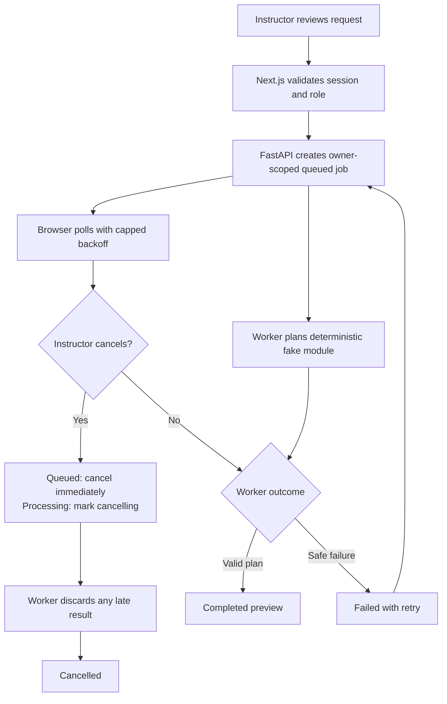
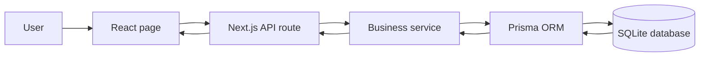
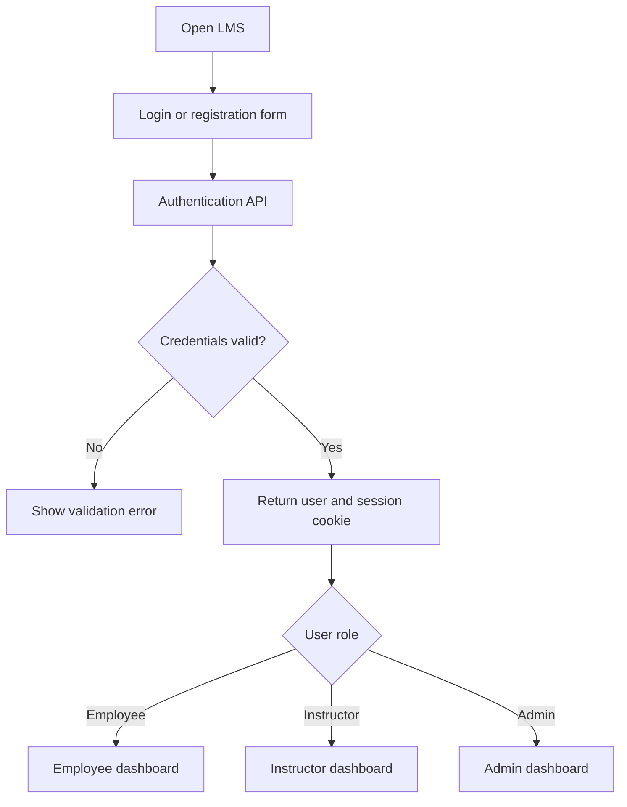
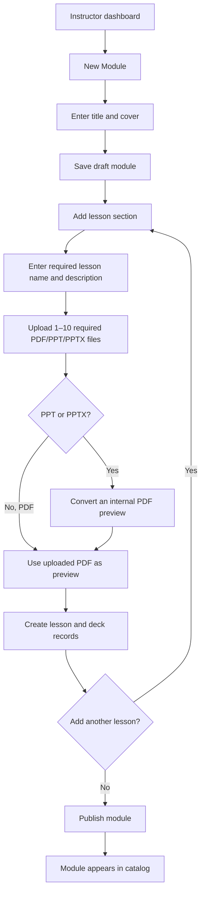
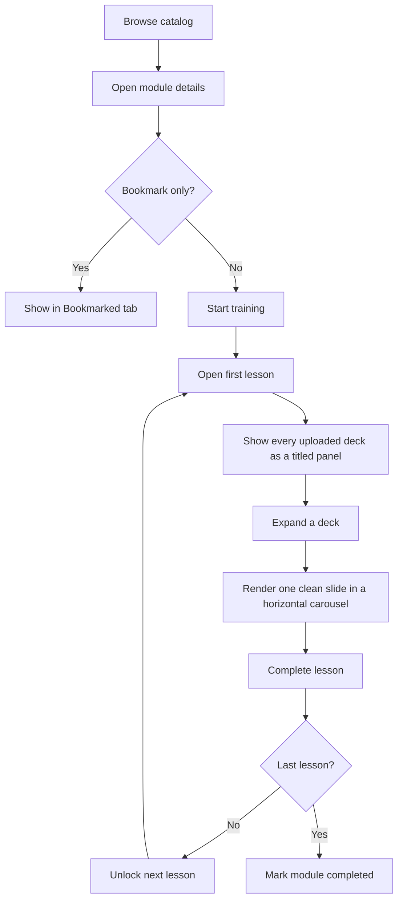
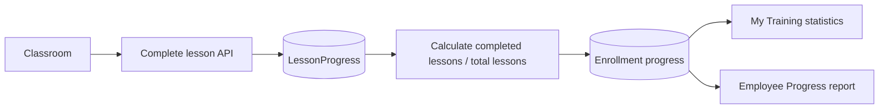
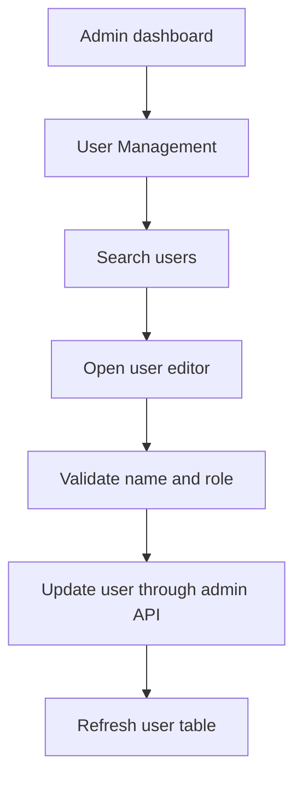
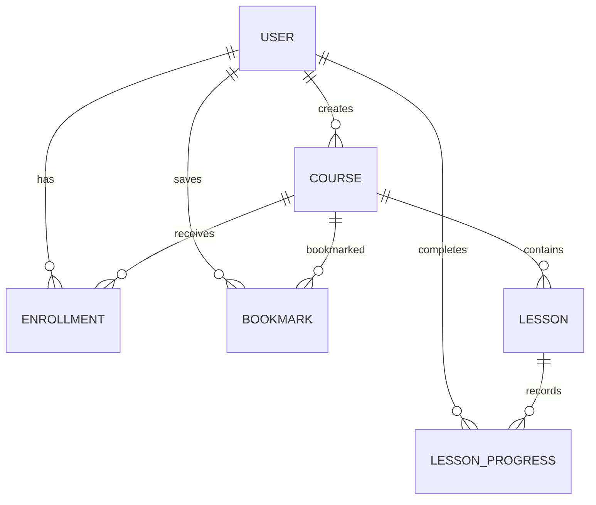

# LMS Project Flowcharts

These diagrams show the core application flow and the implemented fake AI job
lifecycle. They do not imply that a real model, RAG, web search, or presentation
generator is connected.

## AI draft-generation lifecycle

## 1. Overall request flow

## 2. Authentication

## 3. Instructor creates a module

## 4. Employee learning flow

## 5. Progress tracking

## 6. Admin user management

## 7. Main data relationships

